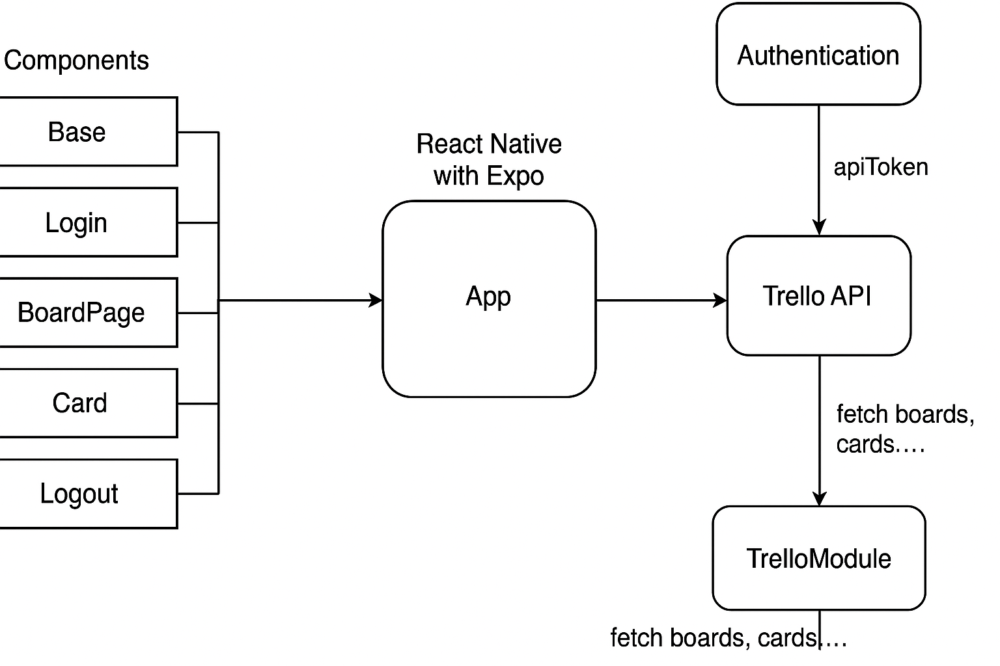

# Trello App

This is a simple Trello-like application built with React Native and Expo. It allows users to create boards, lists, and cards, and manage their tasks in a user-friendly interface.

## Features

- Create and manage workspaces
- Create and manage boards within workspaces and with templates
- Create and manage lists within boards
- Create and manage cards within lists
- Edit and delete cards, lists, and boards

## Installation

1. Install Expo CLI if you haven't already and dependecies:

   ```bash
   npm install -g expo-cli
   npm install
   ```

2. Start the development server:

   ```bash
    npm start
    ```

3. Put your API_KEY in [`App.tsx`](App.tsx) file. You can get your API_KEY from [Trello API](https://trello.com/app-key).
4. Open the app in your preferred simulator or on a physical device using the Expo Go app.
5. Scan the QR code displayed in the terminal or Expo Dev Tools to open the app.
6. Follow the instructions in the app to create a workspace, board, list, and cards.
7. Enjoy managing your tasks with the Trello-like app!

## Screenshots

Doc Diagram:


